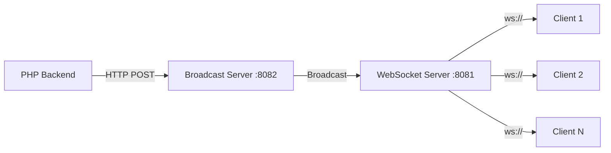
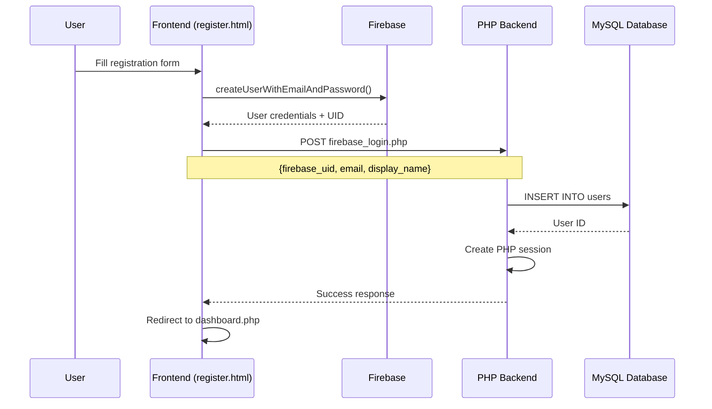
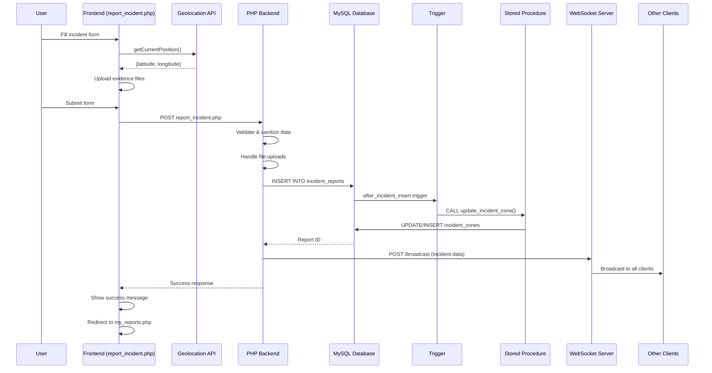
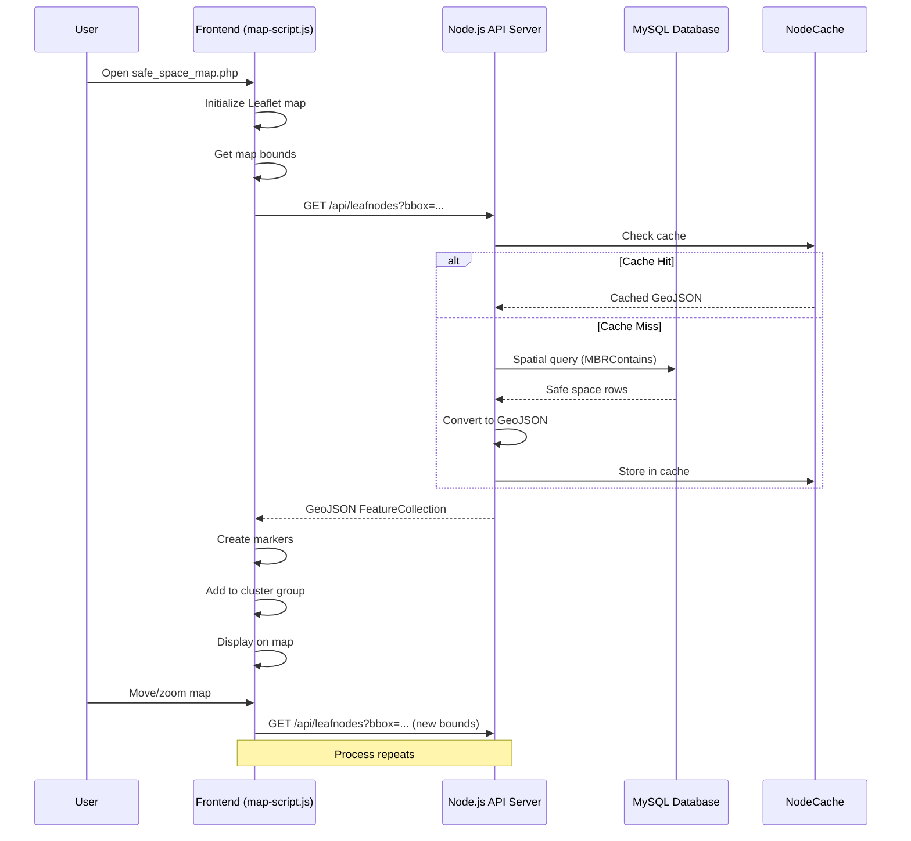
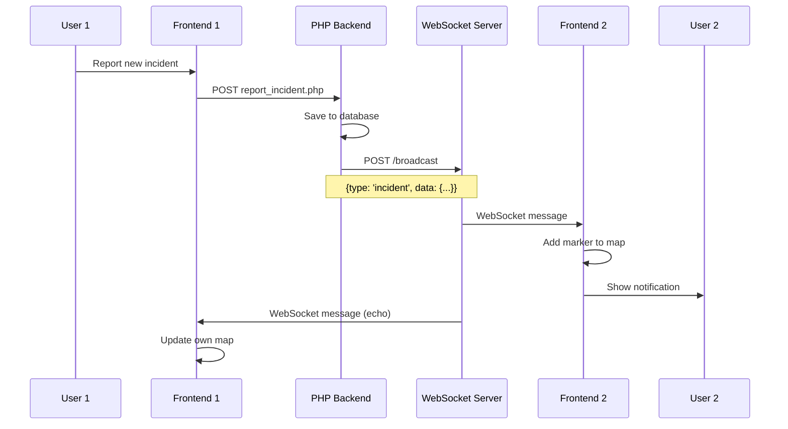
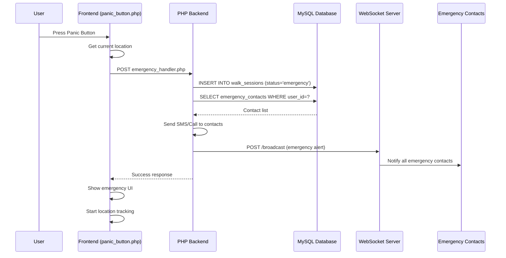
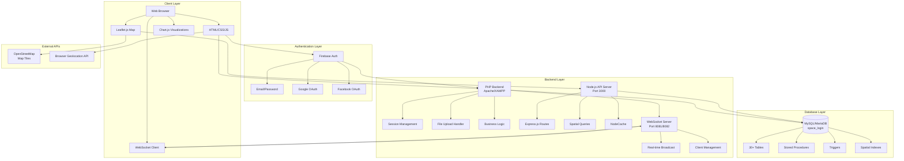

# SafeSpace Project - সম্পূর্ণ আর্কিটেকচার ডকুমেন্টেশন

> **প্রজেক্ট নাম**: SafeSpace - Women Safety & Incident Reporting Platform
> **তৈরি হয়েছে**: বাংলাদেশের নারী ও জনসাধারণের নিরাপত্তার জন্য

---

## 📋 সূচিপত্র

1. [প্রজেক্ট ওভারভিউ](#প্রজেক্ট-ওভারভিউ)
2. [ব্যবহৃত ফ্রেমওয়ার্ক ও টেকনোলজি](#ব্যবহৃত-ফ্রেমওয়ার্ক-ও-টেকনোলজি)
3. [ফ্রন্টএন্ড আর্কিটেকচার](#ফ্রন্টএন্ড-আর্কিটেকচার)
4. [ব্যাকএন্ড আর্কিটেকচার](#ব্যাকএন্ড-আর্কিটেকচার)
5. [ডাটাবেস স্ট্রাকচার](#ডাটাবেস-স্ট্রাকচার)
6. [API ইন্টিগ্রেশন](#api-ইন্টিগ্রেশন)
7. [রিয়েল-টাইম কমিউনিকেশন](#রিয়েল-টাইম-কমিউনিকেশন)
8. [ফ্রন্টএন্ড-ব্যাকএন্ড কমিউনিকেশন ফ্লো](#ফ্রন্টএন্ড-ব্যাকএন্ড-কমিউনিকেশন-ফ্লো)
9. [ডেটা ফ্লো ডায়াগ্রাম](#ডেটা-ফ্লো-ডায়াগ্রাম)

---

## প্রজেক্ট ওভারভিউ

SafeSpace একটি ফুল-স্ট্যাক ওয়েব অ্যাপ্লিকেশন যা নারী ও জনসাধারণের নিরাপত্তার জন্য ডিজাইন করা হয়েছে। এটি ইনসিডেন্ট রিপোর্টিং, রিয়েল-টাইম ম্যাপ ভিজুয়ালাইজেশন, কমিউনিটি সাপোর্ট, এবং ইমার্জেন্সি রেসপন্স ফিচার প্রদান করে।

### মূল বৈশিষ্ট্য:
- 🔐 Multi-provider Authentication (Firebase)
- 📊 Incident Reporting System
- 🗺️ Interactive Safety Map (Leaflet.js)
- 🚨 Emergency Panic Button
- 👥 Community Groups
- 📚 Legal & Medical Support
- 📈 Real-time Analytics
- 🔔 WebSocket-based Live Updates

---

## ব্যবহৃত ফ্রেমওয়ার্ক ও টেকনোলজি

### Frontend Technologies

#### 1. **HTML5 & CSS3**
- **উদ্দেশ্য**: স্ট্রাকচার এবং স্টাইলিং
- **ব্যবহার**: সমস্ত পেজের মার্কআপ এবং ডিজাইন
- **ফাইল**: `index.html`, `register.html`, `dashboard.php`, ইত্যাদি

#### 2. **JavaScript (ES6+)**
- **উদ্দেশ্য**: ক্লায়েন্ট-সাইড লজিক এবং ইন্টারঅ্যাকশন
- **প্রধান ফাইল**:
  - `dashboard-enhanced.js` - ড্যাশবোর্ড ফাংশনালিটি
  - `map-script.js` - ম্যাপ ইন্টিগ্রেশন
  - `script.js` - সাধারণ ইউটিলিটি ফাংশন

#### 3. **TailwindCSS**
- **উদ্দেশ্য**: Utility-first CSS framework
- **ব্যবহার**: দ্রুত এবং responsive UI ডিজাইন
- **ফাইল**: `design-system.css`, `dashboard-styles.css`

#### 4. **Chart.js & ApexCharts**
- **উদ্দেশ্য**: ডেটা ভিজুয়ালাইজেশন
- **ব্যবহার**: ইনসিডেন্ট ট্রেন্ড, স্ট্যাটিস্টিক্স চার্ট
- **কোথায়**: Admin dashboard এবং analytics পেজে

#### 5. **Leaflet.js**
- **উদ্দেশ্য**: Interactive mapping library
- **ব্যবহার**: Safety map, incident zones visualization
- **ফিচার**:
  - Marker clustering
  - Heatmap layers
  - Polygon drawing for safe zones
  - Real-time marker updates
- **ফাইল**: `map-script.js`, `safe_space_map.php`

#### 6. **Three.js**
- **উদ্দেশ্য**: 3D animations এবং effects
- **ব্যবহার**: Portal effects, visual enhancements
- **ফাইল**: `portal-effect.js`

#### 7. **Firebase SDK**
- **উদ্দেশ্য**: Client-side authentication
- **সাপোর্টেড প্রোভাইডার**:
  - Email/Password
  - Google OAuth
  - Facebook OAuth
  - GitHub OAuth
- **ফাইল**: `js/firebase-config.js`

---

### Backend Technologies

#### 1. **PHP 8.2+**
- **উদ্দেশ্য**: Server-side scripting language
- **ব্যবহার**:
  - User authentication & session management
  - Database operations (CRUD)
  - File uploads handling
  - Business logic processing
- **প্রধান ফাইল**:
  - `db.php` - Database connection
  - `auth.php` - Authentication helpers
  - `dashboard.php` - Main dashboard logic
  - `report_incident.php` - Incident reporting
  - `admin_dashboard.php` - Admin panel

#### 2. **Node.js & Express.js**
- **উদ্দেশ্য**: API server for spatial queries
- **পোর্ট**: 3000
- **ফাইল**: `server.js`
- **প্রধান ফিচার**:
  - RESTful API endpoints
  - Spatial query optimization
  - Caching with NodeCache
  - GeoJSON data transformation

**API Endpoints**:
```javascript
GET  /api/leafnodes          // Fetch safe spaces within bounding box
GET  /api/leafnodes/search   // Search locations
GET  /api/leafnodes/heatmap  // Heatmap data
GET  /api/leafnodes/stats    // Statistics
GET  /api/leafnodes/:id      // Single location
POST /api/safe-zones         // Create safe zone
GET  /api/safe-zones         // Get all safe zones
GET  /api/incident-zones     // Get incident zones
POST /api/incident-zones/update // Update zone status
```

#### 3. **WebSocket Server**
- **উদ্দেশ্য**: Real-time bidirectional communication
- **পোর্ট**: 8081 (WebSocket), 8082 (HTTP broadcast)
- **ফাইল**: `websocket-broadcast-server.js`
- **ব্যবহার**:
  - Live map updates
  - Incident notifications
  - Emergency alerts
  - Walk session tracking

#### 4. **Composer (PHP Dependencies)**
- **প্যাকেজ**:
  - `cboden/ratchet` - PHP WebSocket library
  - `textalk/websocket` - WebSocket client

#### 5. **NPM (Node Dependencies)**
- **প্যাকেজ**:
  - `express` - Web framework
  - `mysql2` - MySQL client
  - `cors` - CORS middleware
  - `dotenv` - Environment variables
  - `node-cache` - Caching
  - `ws` - WebSocket library

---

### Database: MySQL/MariaDB

#### **MySQL Spatial Features**
- **POINT Data Type**: Geolocation storage
- **ST_GeomFromText()**: Create geometry from WKT
- **MBRContains()**: Spatial bounding box queries
- **Spatial Indexes**: Fast location-based queries

#### **Advanced Features**:
- Stored Procedures
- Triggers for audit logging
- Functions (Haversine distance calculation)
- Full-text search
- JSON data type support

---

## ফ্রন্টএন্ড আর্কিটেকচার

### Component Structure

```
Frontend/
├── Authentication Layer (Firebase)
│   ├── Login (index.html)
│   ├── Registration (register.html)
│   └── Password Reset (forgot_password.html)
│
├── Main Dashboard (dashboard.php)
│   ├── Welcome Section
│   ├── Quick Actions
│   ├── Statistics Cards
│   ├── Activity Timeline
│   └── Charts & Visualizations
│
├── Incident Management
│   ├── Report Incident (report_incident.php)
│   ├── View Reports (view_public_reports.php)
│   ├── My Reports (my_reports.php)
│   └── Edit Report (edit_report.php)
│
├── Safety Map (safe_space_map.php)
│   ├── Leaflet Map Integration
│   ├── Marker Clustering
│   ├── Heatmap Layer
│   ├── Safe Zones Polygons
│   └── Incident Zones
│
├── Community Features
│   ├── Groups (community_groups.php)
│   ├── Group Details (group_detail.php)
│   ├── Alerts (group_alerts.php)
│   └── Media Gallery (group_media_gallery.php)
│
├── Emergency Features
│   ├── Panic Button (panic_button.php)
│   ├── Emergency Contacts (emergency_contacts.php)
│   └── Walk with Me (walk_with_me.php)
│
└── Support Services
    ├── Legal Aid (legal_aid.php)
    ├── Medical Support (medical_support.php)
    └── Safety Education (safety_education.php)
```

### JavaScript Architecture

#### **SafeSpaceDashboard Class** (`dashboard-enhanced.js`)

```javascript
class SafeSpaceDashboard {
  constructor() {
    this.currentTheme = 'dark';
    this.ws = null; // WebSocket connection
    this.init();
  }

  init() {
    this.setupWebSocket();      // Real-time updates
    this.setupTheme();          // Dark/Light mode
    this.setupAnimations();     // Scroll animations
    this.setupDataVisualization(); // Charts
    this.setupKeyboardShortcuts();
  }

  setupWebSocket() {
    // Connect to ws://localhost:8081/map
    // Listen for map updates, alerts, incidents
  }
}
```

#### **Map Script** (`map-script.js`)

```javascript
// Leaflet Map Initialization
const map = L.map('map', {
  center: [23.8103, 90.4125], // Dhaka
  zoom: 12
});

// Marker Clustering
const clusterGroup = L.markerClusterGroup({
  maxClusterRadius: 60,
  spiderfyOnMaxZoom: true
});

// Load data from API
async function loadMapData() {
  const bounds = map.getBounds();
  const bbox = `${bounds.getWest()},${bounds.getSouth()},
                ${bounds.getEast()},${bounds.getNorth()}`;

  const response = await fetch(
    `http://localhost:3000/api/leafnodes?bbox=${bbox}`
  );
  const geojson = await response.json();

  // Add markers to cluster group
  geojson.features.forEach(feature => {
    const marker = createMarker(feature);
    clusterGroup.addLayer(marker);
  });
}
```

---

## ব্যাকএন্ড আর্কিটেকচার

### PHP Backend Structure

#### **Database Connection** (`db.php`)
```php
<?php
$host = 'localhost';
$user = 'root';
$pass = '';
$db   = 'space_login';

$conn = new mysqli($host, $user, $pass, $db);
if ($conn->connect_error) {
    die('Connection failed: ' . $conn->connect_error);
}
?>
```

#### **Authentication Flow** (`auth.php`, `firebase_login.php`)

1. **Firebase Authentication** (Client-side):
   - User logs in via Firebase SDK
   - Firebase returns ID token

2. **PHP Session Creation**:
   ```php
   // firebase_login.php
   $firebaseUid = $_POST['firebase_uid'];
   $email = $_POST['email'];

   // Check if user exists in database
   $stmt = $conn->prepare("SELECT * FROM users WHERE firebase_uid = ?");
   $stmt->bind_param("s", $firebaseUid);
   $stmt->execute();

   // Create PHP session
   $_SESSION['user_id'] = $user['id'];
   $_SESSION['email'] = $user['email'];
   ```

3. **Session Validation**:
   ```php
   // auth.php
   session_start();
   if (!isset($_SESSION['user_id'])) {
       header('Location: index.html');
       exit;
   }
   ```

#### **Incident Reporting** (`report_incident.php`)

```php
// 1. Receive form data
$title = $_POST['title'];
$description = $_POST['description'];
$category = $_POST['category'];
$severity = $_POST['severity'];
$latitude = $_POST['latitude'];
$longitude = $_POST['longitude'];

// 2. Handle file uploads
$evidenceFiles = [];
foreach ($_FILES['evidence']['tmp_name'] as $key => $tmp_name) {
    $uploadPath = "uploads/evidence/" . uniqid() . "_" . $_FILES['evidence']['name'][$key];
    move_uploaded_file($tmp_name, $uploadPath);
    $evidenceFiles[] = $uploadPath;
}

// 3. Insert into database
$stmt = $conn->prepare("
    INSERT INTO incident_reports
    (user_id, title, description, category, severity, latitude, longitude, evidence_files)
    VALUES (?, ?, ?, ?, ?, ?, ?, ?)
");
$stmt->bind_param("issssdds",
    $_SESSION['user_id'], $title, $description, $category,
    $severity, $latitude, $longitude, json_encode($evidenceFiles)
);
$stmt->execute();

// 4. Trigger zone update (via MySQL trigger)
// 5. Broadcast to WebSocket clients
$broadcastData = [
    'type' => 'incident',
    'data' => ['id' => $reportId, 'location' => [$latitude, $longitude]]
];
file_get_contents('http://localhost:8082/broadcast', false,
    stream_context_create(['http' => [
        'method' => 'POST',
        'content' => json_encode($broadcastData)
    ]])
);
```

### Node.js API Server (`server.js`)

#### **Spatial Query Example**:

```javascript
app.get('/api/leafnodes', async (req, res) => {
  const bbox = parseBBox(req.query.bbox);

  // MySQL spatial query
  const query = `
    SELECT id, name, category, latitude, longitude,
           safety_score, status, description
    FROM leaf_nodes
    WHERE MBRContains(
      ST_GeomFromText(
        CONCAT('POLYGON((', ?, ' ', ?, ', ', ?, ' ', ?, ', ',
               ?, ' ', ?, ', ', ?, ' ', ?, ', ', ?, ' ', ?, '))')
      , 4326),
      location
    )
    ORDER BY safety_score DESC
    LIMIT ?
  `;

  const params = [
    bbox.minLng, bbox.minLat,  // SW corner
    bbox.maxLng, bbox.minLat,  // SE corner
    bbox.maxLng, bbox.maxLat,  // NE corner
    bbox.minLng, bbox.maxLat,  // NW corner
    bbox.minLng, bbox.minLat,  // Close polygon
    limit
  ];

  const [rows] = await pool.execute(query, params);

  // Convert to GeoJSON
  const geojson = {
    type: 'FeatureCollection',
    features: rows.map(nodeToGeoJSON)
  };

  res.json(geojson);
});
```

---

## ডাটাবেস স্ট্রাকচার

### Core Tables (30+ টেবিল)

#### 1. **users** - ইউজার অ্যাকাউন্ট
```sql
CREATE TABLE users (
  id INT PRIMARY KEY AUTO_INCREMENT,
  firebase_uid VARCHAR(255) UNIQUE,
  email VARCHAR(255) UNIQUE NOT NULL,
  display_name VARCHAR(100),
  phone_number VARCHAR(20),
  profile_picture VARCHAR(500),
  is_admin TINYINT(1) DEFAULT 0,
  status ENUM('active', 'suspended', 'deactivated') DEFAULT 'active',
  created_at DATETIME DEFAULT CURRENT_TIMESTAMP
);
```

#### 2. **incident_reports** - ইনসিডেন্ট রিপোর্ট
```sql
CREATE TABLE incident_reports (
  id INT PRIMARY KEY AUTO_INCREMENT,
  user_id INT NOT NULL,
  title VARCHAR(255) NOT NULL,
  description TEXT,
  category ENUM('harassment', 'assault', 'theft', 'vandalism',
                'stalking', 'cyberbullying', 'discrimination', 'other'),
  severity ENUM('low', 'medium', 'high', 'critical') DEFAULT 'medium',
  status ENUM('pending', 'under_review', 'investigating',
              'resolved', 'closed', 'disputed') DEFAULT 'pending',
  location_name VARCHAR(255),
  latitude DECIMAL(10,8),
  longitude DECIMAL(11,8),
  incident_date DATETIME,
  is_anonymous TINYINT(1) DEFAULT 0,
  is_public TINYINT(1) DEFAULT 0,
  evidence_files TEXT, -- JSON array
  FOREIGN KEY (user_id) REFERENCES users(id)
);
```

#### 3. **incident_zones** - নিরাপত্তা জোন
```sql
CREATE TABLE incident_zones (
  id INT PRIMARY KEY AUTO_INCREMENT,
  zone_name VARCHAR(255) NOT NULL,
  area_name VARCHAR(255),
  latitude DECIMAL(10,8) NOT NULL,
  longitude DECIMAL(11,8) NOT NULL,
  location POINT NOT NULL, -- MySQL Spatial type
  report_count INT DEFAULT 0,
  zone_status ENUM('safe', 'moderate', 'unsafe') DEFAULT 'safe',
  last_incident_date DATETIME,
  SPATIAL INDEX(location)
);
```

**Zone Status Logic**:
- 🟢 **Safe**: 0-2 reports
- 🟡 **Moderate**: 3-4 reports
- 🔴 **Unsafe**: 5+ reports

#### 4. **leaf_nodes** - নিরাপদ স্থান (Safe Spaces)
```sql
CREATE TABLE leaf_nodes (
  id INT PRIMARY KEY AUTO_INCREMENT,
  name VARCHAR(255) NOT NULL,
  category VARCHAR(100), -- 'police_station', 'hospital', 'park', etc.
  latitude DECIMAL(10,8) NOT NULL,
  longitude DECIMAL(11,8) NOT NULL,
  location POINT NOT NULL,
  safety_score DECIMAL(3,1) DEFAULT 5.0,
  status ENUM('safe', 'moderate', 'unsafe') DEFAULT 'moderate',
  description TEXT,
  address VARCHAR(500),
  contact VARCHAR(50),
  hours VARCHAR(100),
  amenities TEXT, -- JSON array
  SPATIAL INDEX(location)
);
```

#### 5. **neighborhood_groups** - কমিউনিটি গ্রুপ
```sql
CREATE TABLE neighborhood_groups (
  id INT PRIMARY KEY AUTO_INCREMENT,
  name VARCHAR(255) NOT NULL,
  description TEXT,
  area_name VARCHAR(255),
  group_type ENUM('neighborhood', 'workplace', 'school', 'general'),
  privacy ENUM('public', 'private') DEFAULT 'public',
  member_count INT DEFAULT 0,
  approval_status ENUM('pending', 'approved', 'rejected') DEFAULT 'pending',
  created_by INT,
  FOREIGN KEY (created_by) REFERENCES users(id)
);
```

#### 6. **emergency_contacts** - জরুরি যোগাযোগ
```sql
CREATE TABLE emergency_contacts (
  id INT PRIMARY KEY AUTO_INCREMENT,
  user_id INT NOT NULL,
  contact_name VARCHAR(100) NOT NULL,
  phone_number VARCHAR(20) NOT NULL,
  relationship VARCHAR(50),
  priority INT(1) DEFAULT 1,
  is_verified TINYINT(1) DEFAULT 0,
  notification_methods TEXT DEFAULT 'sms,call',
  FOREIGN KEY (user_id) REFERENCES users(id)
);
```

#### 7. **walk_sessions** - Walk with Me ট্র্যাকিং
```sql
CREATE TABLE walk_sessions (
  id INT PRIMARY KEY AUTO_INCREMENT,
  user_id INT NOT NULL,
  session_token VARCHAR(255) UNIQUE,
  start_location_lat DECIMAL(10,8),
  start_location_lng DECIMAL(11,8),
  current_location_lat DECIMAL(10,8),
  current_location_lng DECIMAL(11,8),
  destination_lat DECIMAL(10,8),
  destination_lng DECIMAL(11,8),
  status ENUM('active', 'completed', 'emergency', 'cancelled'),
  started_at DATETIME DEFAULT CURRENT_TIMESTAMP,
  ended_at DATETIME,
  FOREIGN KEY (user_id) REFERENCES users(id)
);
```

### Stored Procedures

#### **update_incident_zone** - জোন স্ট্যাটাস আপডেট
```sql
DELIMITER $$
CREATE PROCEDURE update_incident_zone(
  IN p_zone_name VARCHAR(255),
  IN p_area_name VARCHAR(255),
  IN p_latitude DECIMAL(10,8),
  IN p_longitude DECIMAL(11,8),
  IN p_incident_date DATETIME
)
BEGIN
  DECLARE v_count INT DEFAULT 0;
  DECLARE v_status ENUM('safe', 'moderate', 'unsafe');

  -- Count reports in this zone (within 0.01 degree radius)
  SELECT COUNT(*) INTO v_count
  FROM incident_reports
  WHERE location_name = p_zone_name
    AND (latitude BETWEEN p_latitude - 0.01 AND p_latitude + 0.01)
    AND (longitude BETWEEN p_longitude - 0.01 AND p_longitude + 0.01)
    AND status != 'disputed';

  -- Determine status based on count
  SET v_status = update_zone_status(v_count);

  -- Insert or update zone
  INSERT INTO incident_zones (
    zone_name, area_name, latitude, longitude, location,
    report_count, zone_status, last_incident_date
  ) VALUES (
    p_zone_name, p_area_name, p_latitude, p_longitude,
    ST_GeomFromText(CONCAT('POINT(', p_longitude, ' ', p_latitude, ')'), 4326),
    v_count, v_status, p_incident_date
  )
  ON DUPLICATE KEY UPDATE
    report_count = v_count,
    zone_status = v_status,
    last_incident_date = p_incident_date;
END$$
DELIMITER ;
```

### Functions

#### **haversine_distance** - দূরত্ব হিসাব
```sql
CREATE FUNCTION haversine_distance(
  lat1 DECIMAL(10,8), lon1 DECIMAL(11,8),
  lat2 DECIMAL(10,8), lon2 DECIMAL(11,8)
) RETURNS DECIMAL(10,2)
BEGIN
  DECLARE R DECIMAL(10,2) DEFAULT 6371; -- Earth radius in km
  DECLARE dlat, dlon, a, c DECIMAL(10,8);

  SET dlat = RADIANS(lat2 - lat1);
  SET dlon = RADIANS(lon2 - lon1);
  SET a = SIN(dlat/2) * SIN(dlat/2) +
          COS(RADIANS(lat1)) * COS(RADIANS(lat2)) *
          SIN(dlon/2) * SIN(dlon/2);
  SET c = 2 * ATAN2(SQRT(a), SQRT(1-a));

  RETURN R * c;
END;
```

### Triggers

#### **after_incident_insert** - রিপোর্ট সাবমিটের পর
```sql
CREATE TRIGGER after_incident_insert
AFTER INSERT ON incident_reports
FOR EACH ROW
BEGIN
  IF NEW.location_name IS NOT NULL AND
     NEW.latitude IS NOT NULL AND
     NEW.longitude IS NOT NULL THEN
    CALL update_incident_zone(
      NEW.location_name,
      COALESCE(NEW.address, NEW.location_name),
      NEW.latitude,
      NEW.longitude,
      COALESCE(NEW.incident_date, NOW())
    );
  END IF;
END;
```

#### **Audit Logging Triggers**
```sql
CREATE TRIGGER tr_incident_reports_after_insert_audit
AFTER INSERT ON incident_reports
FOR EACH ROW
BEGIN
  INSERT INTO audit_logs (user_id, action, table_name, record_id, new_values)
  VALUES (NEW.user_id, 'INSERT', 'incident_reports', NEW.id,
          JSON_OBJECT('status', NEW.status, 'severity', NEW.severity));
END;
```

---

## API ইন্টিগ্রেশন

### 1. **Firebase Authentication API**

**Purpose**: User authentication এবং authorization

**Integration**:
```javascript
// Frontend (index.html, register.html)
import { initializeApp } from 'firebase/app';
import { getAuth, signInWithEmailAndPassword,
         signInWithPopup, GoogleAuthProvider } from 'firebase/auth';

const firebaseConfig = {
  apiKey: "YOUR_API_KEY",
  authDomain: "YOUR_AUTH_DOMAIN",
  projectId: "YOUR_PROJECT_ID"
};

const app = initializeApp(firebaseConfig);
const auth = getAuth(app);

// Email/Password Login
signInWithEmailAndPassword(auth, email, password)
  .then((userCredential) => {
    const user = userCredential.user;
    // Send to PHP backend
    fetch('firebase_login.php', {
      method: 'POST',
      body: JSON.stringify({
        firebase_uid: user.uid,
        email: user.email,
        display_name: user.displayName
      })
    });
  });

// Google OAuth
const provider = new GoogleAuthProvider();
signInWithPopup(auth, provider)
  .then((result) => {
    // Handle result
  });
```

### 2. **OpenStreetMap (Leaflet.js)**

**Purpose**: Map tiles এবং geolocation data

**Integration**:
```javascript
// map-script.js
L.tileLayer('https://{s}.basemaps.cartocdn.com/light_all/{z}/{x}/{y}{r}.png', {
  attribution: '© OpenStreetMap contributors © CARTO',
  maxZoom: 19
}).addTo(map);
```

**API Calls**: None (tiles are free)

### 3. **Internal Node.js API**

**Base URL**: `http://localhost:3000/api`

**Endpoints**:

#### GET `/api/leafnodes`
```javascript
// Fetch safe spaces within map bounds
const bounds = map.getBounds();
const bbox = `${bounds.getWest()},${bounds.getSouth()},
              ${bounds.getEast()},${bounds.getNorth()}`;

fetch(`http://localhost:3000/api/leafnodes?bbox=${bbox}&zoom=12&limit=1000`)
  .then(res => res.json())
  .then(geojson => {
    // geojson.features contains array of safe spaces
    geojson.features.forEach(feature => {
      const marker = L.marker([
        feature.geometry.coordinates[1],
        feature.geometry.coordinates[0]
      ]);
      marker.addTo(map);
    });
  });
```

#### GET `/api/leafnodes/search`
```javascript
// Search for locations
fetch(`http://localhost:3000/api/leafnodes/search?q=hospital&limit=50`)
  .then(res => res.json())
  .then(results => {
    // Display search results
  });
```

#### GET `/api/incident-zones`
```javascript
// Fetch incident zones (colored by safety status)
fetch(`http://localhost:3000/api/incident-zones?bbox=${bbox}`)
  .then(res => res.json())
  .then(geojson => {
    geojson.features.forEach(feature => {
      const color = feature.properties.zone_status === 'unsafe'
        ? '#dc3545' // Red
        : feature.properties.zone_status === 'moderate'
        ? '#ffc107' // Yellow
        : '#28a745'; // Green

      L.circleMarker([
        feature.geometry.coordinates[1],
        feature.geometry.coordinates[0]
      ], {
        radius: 15,
        fillColor: color,
        fillOpacity: 0.7
      }).addTo(map);
    });
  });
```

### 4. **Geolocation API (Browser)**

**Purpose**: ইউজারের বর্তমান অবস্থান পাওয়া

```javascript
// report_incident.php, walk_with_me.php
navigator.geolocation.getCurrentPosition((position) => {
  const latitude = position.coords.latitude;
  const longitude = position.coords.longitude;

  // Update form fields or map
  document.getElementById('latitude').value = latitude;
  document.getElementById('longitude').value = longitude;

  // Center map on user location
  map.setView([latitude, longitude], 15);
});
```

---

## রিয়েল-টাইম কমিউনিকেশন

### WebSocket Architecture



### WebSocket Server (`websocket-broadcast-server.js`)

```javascript
const WebSocket = require('ws');
const http = require('http');

// WebSocket server for clients
const wss = new WebSocket.Server({ port: 8081, path: '/map' });
const clients = new Set();

wss.on('connection', (ws) => {
  console.log('New client connected');
  clients.add(ws);

  ws.on('close', () => {
    clients.delete(ws);
  });

  // Send welcome message
  ws.send(JSON.stringify({
    type: 'connected',
    message: 'Connected to map updates'
  }));
});

// HTTP server to receive broadcast requests from PHP
const server = http.createServer((req, res) => {
  if (req.method === 'POST' && req.url === '/broadcast') {
    let body = '';

    req.on('data', chunk => {
      body += chunk.toString();
    });

    req.on('end', () => {
      const data = JSON.parse(body);

      // Broadcast to all connected clients
      const message = JSON.stringify({
        type: 'map_update',
        update_type: data.type, // 'incident', 'alert', 'zone'
        data: data.data,
        timestamp: Date.now()
      });

      let sentCount = 0;
      clients.forEach(client => {
        if (client.readyState === WebSocket.OPEN) {
          client.send(message);
          sentCount++;
        }
      });

      res.writeHead(200);
      res.end(JSON.stringify({ success: true, clients: sentCount }));
    });
  }
});

server.listen(8082);
```

### Client-side WebSocket (`dashboard-enhanced.js`)

```javascript
class SafeSpaceDashboard {
  setupWebSocket() {
    this.ws = new WebSocket('ws://localhost:8081/map');

    this.ws.onopen = () => {
      console.log('WebSocket connected');
    };

    this.ws.onmessage = (event) => {
      const message = JSON.parse(event.data);

      switch(message.type) {
        case 'map_update':
          this.handleMapUpdate(message);
          break;
        case 'incident':
          this.showNotification('New incident reported!');
          this.refreshMap();
          break;
        case 'alert':
          this.showEmergencyAlert(message.data);
          break;
      }
    };

    this.ws.onerror = (error) => {
      console.error('WebSocket error:', error);
    };
  }

  handleMapUpdate(message) {
    if (message.update_type === 'incident') {
      // Add new marker to map
      const { latitude, longitude, title } = message.data;
      const marker = L.marker([latitude, longitude])
        .bindPopup(title)
        .addTo(map);
    }
  }
}
```

### PHP Broadcasting Example

```php
// report_incident.php - After inserting incident
function broadcastMapUpdate($type, $data) {
    $broadcastData = [
        'type' => $type,
        'data' => $data
    ];

    $options = [
        'http' => [
            'method' => 'POST',
            'header' => 'Content-Type: application/json',
            'content' => json_encode($broadcastData)
        ]
    ];

    $context = stream_context_create($options);
    $result = file_get_contents(
        'http://localhost:8082/broadcast',
        false,
        $context
    );

    return json_decode($result, true);
}

// Usage
$reportData = [
    'id' => $reportId,
    'latitude' => $latitude,
    'longitude' => $longitude,
    'title' => $title,
    'severity' => $severity
];

broadcastMapUpdate('incident', $reportData);
```

---

## ফ্রন্টএন্ড-ব্যাকএন্ড কমিউনিকেশন ফ্লো

### 1. **User Registration Flow**



### 2. **Incident Reporting Flow**



### 3. **Map Data Loading Flow**



### 4. **Real-time Update Flow**



### 5. **Emergency Alert Flow**



---

## ডেটা ফ্লো ডায়াগ্রাম

### Complete System Architecture



---

## Database Operations বিস্তারিত

### 1. **Data Fetching (SELECT)**

#### Example: Get User's Reports
```php
// my_reports.php
$userId = $_SESSION['user_id'];

$stmt = $conn->prepare("
    SELECT
        ir.*,
        CASE
            WHEN ir.status = 'pending' THEN 'Pending Review'
            WHEN ir.status = 'under_review' THEN 'Under Review'
            WHEN ir.status = 'resolved' THEN 'Resolved'
        END as status_text,
        DATE_FORMAT(ir.reported_date, '%d %M %Y') as formatted_date
    FROM incident_reports ir
    WHERE ir.user_id = ?
    ORDER BY ir.reported_date DESC
    LIMIT 50
");

$stmt->bind_param("i", $userId);
$stmt->execute();
$result = $stmt->get_result();

while ($row = $result->fetch_assoc()) {
    // Display report
    echo "<div class='report-card'>";
    echo "<h3>" . htmlspecialchars($row['title']) . "</h3>";
    echo "<p>" . htmlspecialchars($row['description']) . "</p>";
    echo "<span class='status'>" . $row['status_text'] . "</span>";
    echo "</div>";
}
```

#### Example: Spatial Query (Node.js)
```javascript
// server.js - Find nearby safe spaces
app.get('/api/leafnodes/nearby', async (req, res) => {
  const { lat, lng, radius } = req.query;

  const query = `
    SELECT
      id, name, category, latitude, longitude, safety_score,
      haversine_distance(?, ?, latitude, longitude) as distance
    FROM leaf_nodes
    WHERE haversine_distance(?, ?, latitude, longitude) <= ?
    ORDER BY distance ASC
    LIMIT 20
  `;

  const [rows] = await pool.execute(query, [
    lat, lng, lat, lng, radius
  ]);

  res.json(rows);
});
```

### 2. **Data Insertion (INSERT)**

#### Example: Create Incident Report
```php
// report_incident.php
$stmt = $conn->prepare("
    INSERT INTO incident_reports (
        user_id, title, description, category, severity,
        location_name, latitude, longitude, address,
        incident_date, is_anonymous, is_public, evidence_files
    ) VALUES (?, ?, ?, ?, ?, ?, ?, ?, ?, ?, ?, ?, ?)
");

$stmt->bind_param(
    "isssssddssiis",
    $_SESSION['user_id'],
    $title,
    $description,
    $category,
    $severity,
    $locationName,
    $latitude,
    $longitude,
    $address,
    $incidentDate,
    $isAnonymous,
    $isPublic,
    json_encode($evidenceFiles)
);

if ($stmt->execute()) {
    $reportId = $stmt->insert_id;

    // Trigger automatically calls update_incident_zone()
    // via after_incident_insert trigger

    echo json_encode([
        'success' => true,
        'report_id' => $reportId
    ]);
}
```

### 3. **Data Update (UPDATE)**

#### Example: Approve Incident Report (Admin)
```php
// admin_approval_handler.php
$reportId = $_POST['report_id'];
$action = $_POST['action']; // 'approve' or 'reject'

if ($action === 'approve') {
    $stmt = $conn->prepare("
        UPDATE incident_reports
        SET status = 'under_review',
            updated_date = NOW()
        WHERE id = ?
    ");
    $stmt->bind_param("i", $reportId);
    $stmt->execute();

    // Log audit trail
    $auditStmt = $conn->prepare("
        INSERT INTO audit_logs (
            user_id, action, table_name, record_id, new_values
        ) VALUES (?, 'admin_approval', 'incident_report', ?, ?)
    ");
    $auditData = json_encode([
        'action' => 'approve',
        'approval_status' => 'approved'
    ]);
    $auditStmt->bind_param("iis",
        $_SESSION['user_id'], $reportId, $auditData
    );
    $auditStmt->execute();
}
```

### 4. **Complex Queries with JOINs**

#### Example: Get Group with Members
```php
// group_detail.php
$groupId = $_GET['id'];

$stmt = $conn->prepare("
    SELECT
        ng.*,
        u.display_name as founder_name,
        COUNT(DISTINCT gm.id) as total_members,
        COUNT(DISTINCT ga.id) as total_alerts
    FROM neighborhood_groups ng
    LEFT JOIN users u ON ng.created_by = u.id
    LEFT JOIN group_members gm ON ng.id = gm.group_id
    LEFT JOIN group_alerts ga ON ng.id = ga.group_id
    WHERE ng.id = ?
    GROUP BY ng.id
");

$stmt->bind_param("i", $groupId);
$stmt->execute();
$group = $stmt->get_result()->fetch_assoc();

// Get members
$membersStmt = $conn->prepare("
    SELECT
        gm.*,
        u.display_name,
        u.profile_picture,
        u.email
    FROM group_members gm
    JOIN users u ON gm.user_id = u.id
    WHERE gm.group_id = ?
    ORDER BY
        CASE gm.role
            WHEN 'founder' THEN 1
            WHEN 'admin' THEN 2
            WHEN 'moderator' THEN 3
            ELSE 4
        END,
        gm.joined_at ASC
");

$membersStmt->bind_param("i", $groupId);
$membersStmt->execute();
$members = $membersStmt->get_result()->fetch_all(MYSQLI_ASSOC);
```

---

## সার্ভার স্টার্টআপ প্রসেস

### 1. **XAMPP (Apache + MySQL)**
```bash
# Start from XAMPP Control Panel
- Start Apache
- Start MySQL
```

### 2. **Node.js Servers**

#### Option 1: Manual Start
```bash
# Terminal 1 - API Server
cd c:\xampp\htdocs\space-login
npm start
# Runs: node server.js
# Listening on: http://localhost:3000

# Terminal 2 - WebSocket Server
npm run broadcast
# Runs: node websocket-broadcast-server.js
# WebSocket: ws://localhost:8081/map
# HTTP: http://localhost:8082/broadcast
```

#### Option 2: Batch File (Windows)
```batch
REM START_REALTIME_SERVERS.bat
@echo off
echo Starting SafeSpace Real-time Servers...

start "Node API Server" cmd /k "npm start"
timeout /t 2 /nobreak > nul

start "WebSocket Broadcast Server" cmd /k "npm run broadcast"

echo.
echo All servers started!
echo - API Server: http://localhost:3000
echo - WebSocket: ws://localhost:8081/map
echo - Broadcast: http://localhost:8082/broadcast
pause
```

### 3. **Access Application**
```
Main App: http://localhost/space-login/
Admin Panel: http://localhost/space-login/admin_dashboard.php
```

---

## সিকিউরিটি ফিচার

### 1. **SQL Injection Prevention**
```php
// Always use prepared statements
$stmt = $conn->prepare("SELECT * FROM users WHERE email = ?");
$stmt->bind_param("s", $email);
$stmt->execute();
```

### 2. **XSS Prevention**
```php
// Sanitize output
echo htmlspecialchars($userInput, ENT_QUOTES, 'UTF-8');
```

### 3. **CSRF Protection**
```php
// Generate token
$_SESSION['csrf_token'] = bin2hex(random_bytes(32));

// Validate token
if ($_POST['csrf_token'] !== $_SESSION['csrf_token']) {
    die('Invalid CSRF token');
}
```

### 4. **File Upload Validation**
```php
$allowedExtensions = ['jpg', 'jpeg', 'png', 'pdf'];
$maxFileSize = 10 * 1024 * 1024; // 10MB

$extension = strtolower(pathinfo($_FILES['file']['name'], PATHINFO_EXTENSION));

if (!in_array($extension, $allowedExtensions)) {
    die('Invalid file type');
}

if ($_FILES['file']['size'] > $maxFileSize) {
    die('File too large');
}
```

### 5. **Session Security**
```php
session_start([
    'cookie_lifetime' => 0,
    'cookie_httponly' => true,
    'cookie_secure' => true, // HTTPS only
    'cookie_samesite' => 'Strict'
]);
```

---

## পারফরম্যান্স অপটিমাইজেশন

### 1. **Database Indexing**
```sql
-- Spatial indexes for location queries
CREATE SPATIAL INDEX idx_location ON leaf_nodes(location);
CREATE SPATIAL INDEX idx_zone_location ON incident_zones(location);

-- Regular indexes for frequent queries
CREATE INDEX idx_user_id ON incident_reports(user_id);
CREATE INDEX idx_status ON incident_reports(status);
CREATE INDEX idx_incident_date ON incident_reports(incident_date);
```

### 2. **Caching (Node.js)**
```javascript
const NodeCache = require('node-cache');
const cache = new NodeCache({ stdTTL: 300 }); // 5 minutes

app.get('/api/leafnodes', async (req, res) => {
  const cacheKey = `leafnodes:${req.query.bbox}`;
  const cached = cache.get(cacheKey);

  if (cached) {
    return res.json(cached);
  }

  // Fetch from database
  const data = await fetchFromDatabase();
  cache.set(cacheKey, data);
  res.json(data);
});
```

### 3. **Lazy Loading**
```javascript
// Load map markers only when visible
map.on('moveend', debounce(() => {
  loadMapData();
}, 300));
```

---

## সংক্ষিপ্ত সারাংশ

### Frontend Stack:
- **HTML/CSS/JS** - UI structure
- **TailwindCSS** - Styling
- **Leaflet.js** - Maps
- **Chart.js** - Visualizations
- **Firebase SDK** - Authentication

### Backend Stack:
- **PHP 8.2+** - Main backend logic
- **Node.js + Express** - API server
- **WebSocket** - Real-time updates
- **MySQL/MariaDB** - Database with spatial features

### Key APIs:
- **Firebase Auth API** - User authentication
- **OpenStreetMap** - Map tiles
- **Geolocation API** - User location
- **Internal REST API** - Spatial queries

### Database:
- **30+ tables** with relationships
- **Stored procedures** for zone updates
- **Triggers** for audit logging
- **Spatial functions** for distance calculations

### Real-time:
- **WebSocket server** on port 8081
- **HTTP broadcast** on port 8082
- **Live map updates**
- **Emergency alerts**

---

## যোগাযোগ ও সাপোর্ট

এই ডকুমেন্টেশন SafeSpace প্রজেক্টের সম্পূর্ণ আর্কিটেকচার ব্যাখ্যা করে। যেকোনো প্রশ্ন বা সমস্যার জন্য প্রজেক্ট কোড রিভিউ করুন অথবা ডেভেলপার টিমের সাথে যোগাযোগ করুন।

**Last Updated**: January 2026
